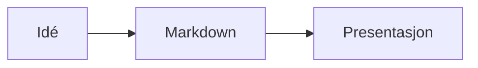
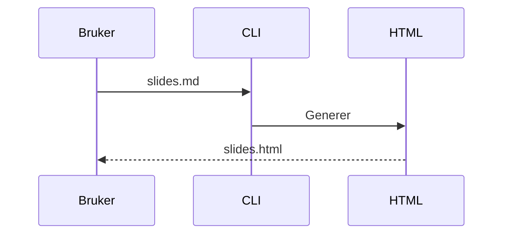

# Anna.js

Presentasjonsrammeverk for web med Markdown-first workflow. Terminal-animasjoner, live kode, Mermaid-diagrammer, AI-generering, embed-modus og 12 temaer.

## Installasjon

```bash
npm install -g anna.js
```

## Kom i gang

```bash
anna init my-presentation          # nytt prosjekt med alle filer
anna generate slides.md            # generer HTML fra Markdown
anna generate slides.md --watch    # regenerer ved endringer
anna ai "Intro til Kubernetes"     # AI-generert presentasjon
anna export slides.md              # eksporter til PDF
```

## Eksempel

`````markdown
---
title: Min presentasjon
theme: moon
transition: slide
---

# Velkommen

---

## Fragmenter

<!-- .fragments -->
- Vises ett om gangen
- Med piltaster

--

### Vertikal sub-slide

---



---

```terminal
$ anna init demo
  ✓ Created slides.md

$ anna generate slides.md
  ✓ slides.md → slides.html
```

---

```playground
console.log("Hello, Anna.js!");
```

---

<!-- .slide: data-background="#4d7e65" -->

## Bakgrunnsfarge

---

Note:
Speaker notes — trykk S for å åpne.

---

# Takk!
`````

## Syntaks

| Syntaks | Funksjon |
|---|---|
| `---` | Horisontal slide-separator |
| `--` | Vertikal slide-separator |
| `<!-- .fragments -->` | Animerer hvert listepunkt |
| `<!-- .fragment -->` | Gjør paragraf til fragment |
| `<!-- .slide: data-background="#hex" -->` | Bakgrunnsfarge |
| `<!-- .slide: data-background-image="img.jpg" -->` | Bakgrunnsbilde |
| `` | Bilde (auto-skalert) |
| `Note:` | Speaker notes |
| ` ```terminal ` | Animert terminal med typing-effekt |
| ` ```mermaid ` | Diagrammer (flowchart, sekvens, gantt) |
| ` ```playground ` | Live kodeeditor (JS, HTML, CSS) |

## Frontmatter

```yaml
---
title: Tittel
author: Navn
theme: league        # 12 temaer
transition: slide    # slide, fade, convex, concave, zoom, none
controls: true
progress: true
center: true
hash: true
autoSlide: 0
loop: false
---
```

## Terminal-slides

Kommandoer types ut karakter for karakter. Hvert kommando-par er et fragment-steg.

````markdown
```terminal
$ npm install anna.js
added 42 packages in 2.3s

$ anna generate slides.md
✓ slides.md → slides.html
```
````

## Live Code Playground

Kjørbar kode direkte i slides — perfekt for workshops og kurs. Ctrl+Enter for å kjøre.

````markdown
```playground
const name = "Anna";
console.log(`Hello, ${name}!`);
```

```playground html
<h1 style="color: coral">Hello!</h1>
```
````

Støtter JavaScript, HTML og CSS. Sandboxed kjøring.

## Mermaid-diagrammer

Flowcharts, sekvensdiagrammer, gantt-charts og mer. Tema tilpasses automatisk.

````markdown

````

Krever internett (Mermaid lastes fra CDN).

## AI-generering

Generer en komplett presentasjon fra en outline eller et emne:

```bash
anna ai outline.txt
anna ai "Introduction to Kubernetes" --theme moon
```

Bruker Claude API. Krever `ANTHROPIC_API_KEY` og `npm install @anthropic-ai/sdk`.

## Speaker View

Trykk **S** for utvidet speaker-view:

- **Nedtellingstimer** — grønn/gul/rød, pulserer ved overtime
- **Tidsbruk per slide** — sanntidssporing
- **Neste-slide forhåndsvisning**
- **Fremdriftslinje** — slide X av Y
- **Tre layouts** — Default, Wide, Notes-only

Timer og layout huskes via localStorage.

## Embed-modus

Slides som web components for bloggposter og dokumentasjon:

```html
<script src="https://unpkg.com/anna.js/js/anna-embed.js"></script>

<anna-slide theme="moon">
  ## Hello World
  - Punkt 1
  - Punkt 2
</anna-slide>

<anna-deck theme="night">
  <anna-slide># Slide 1</anna-slide>
  <anna-slide># Slide 2</anna-slide>
</anna-deck>
```

Shadow DOM, alle 11 temaer, fragmenter, tastaturnavigasjon. Én `<script>`-tag.

## Temaer

**Mørke:** black, night, moon, blood, league (standard)
**Lyse:** white, beige, sky, serif, simple, solarized

## Keyboard shortcuts

| Tast | Funksjon |
|---|---|
| Piltaster | Naviger mellom slides |
| Space / N | Neste slide |
| P | Forrige slide |
| ESC / O | Slide-oversikt |
| S | Speaker notes |
| F | Fullskjerm |
| B / . | Pause (svart skjerm) |

## Utvikling

```bash
npm install
npm run build     # kompiler SCSS + minifiser CSS/JS
npm start         # utviklingsserver med livereload
npm test          # lint + 32 tester
```

## Plugins

markdown, highlight, notes, math, search, zoom, multiplex, terminal, mermaid, playground

## Lisens

MIT — Knut W. Horne ([kwhorne.com](https://kwhorne.com))
