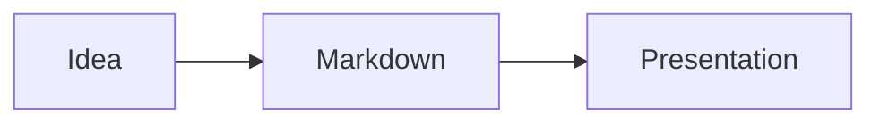

# Anna.js

A Markdown-first presentation framework for the web. Terminal animations, live code playgrounds with syntax highlighting, Mermaid diagrams, AI generation, live audience interaction, offline PWA mode, and 11 themes.

## Installation

```bash
npm install -g @kwhorne/anna.js
```

## Quick Start

```bash
anna init my-presentation          # scaffold a new project
anna generate slides.md            # generate HTML from Markdown
anna generate slides.md --watch    # regenerate on changes
anna serve slides.md               # dev server with live reload
anna live slides.md                # live server with polls, Q&A, reactions
anna ai "Intro to Kubernetes"      # AI-generated presentation
anna ai refine slides.md           # improve existing slides with AI
anna ai translate slides.md --lang en  # translate to another language
anna export slides.md              # export to PDF
```

## Example

`````markdown
---
title: My Presentation
theme: moon
transition: slide
---

# Welcome

---

## Fragments

<!-- .fragments -->
- Revealed one at a time
- Using arrow keys

--

### Vertical sub-slide

---



---

```terminal
$ anna init demo
  ✓ Created slides.md

$ anna generate slides.md
  ✓ slides.md → slides.html
```

---

```playground
console.log("Hello, Anna.js!");
```

---

<!-- .slide: data-background="#4d7e65" -->

## Custom Background

---

Note:
Speaker notes — press S to open.

---

# Thanks!
`````

## Syntax

| Syntax | Function |
|---|---|
| `---` | Horizontal slide separator |
| `--` | Vertical slide separator |
| `<!-- .fragments -->` | Animate each list item |
| `<!-- .fragment -->` | Make paragraph a fragment |
| `<!-- .slide: data-background="#hex" -->` | Background color |
| `<!-- .slide: data-background-image="img.jpg" -->` | Background image |
| `` | Image (auto-scaled) |
| `Note:` | Speaker notes |
| ` ```terminal ` | Animated terminal with typing effect |
| ` ```mermaid ` | Diagrams (flowchart, sequence, gantt) |
| ` ```playground ` | Live code editor (JS, HTML, CSS) |
| ` ```playground multi ` | Multi-file editor (JS + HTML + CSS tabs) |
| ` ```playground step ` | Step-by-step code with diff highlighting |
| ` ```poll ` | Live poll (requires `anna live`) |
| ` ```qa ` | Live Q&A (requires `anna live`) |
| `<!-- @columns -->` | Multi-column layout |
| `<!-- @comparison -->` | Side-by-side pros/cons |
| `<!-- @timeline -->` | Vertical timeline |
| `<!-- @quote -->` | Styled blockquote with attribution |
| `<!-- @stats -->` | Big number statistics |
| `<!-- @cards -->` | Card grid layout |
| `<!-- @image-text -->` | Image + text side-by-side |
| `<!-- @icon-list -->` | Icon list with descriptions |
| `<!-- @component -->` | Define a reusable component |
| `<!-- @use -->` | Use a defined component |

## Frontmatter

```yaml
---
title: Title
author: Name
theme: league        # 12 themes available
transition: slide    # slide, fade, convex, concave, zoom, none
controls: true
progress: true
center: true
hash: true
autoSlide: 0
loop: false
---
```

## Terminal Slides

Commands are typed out character by character. Each command group is a fragment step.

````markdown
```terminal
$ npm install anna.js
added 42 packages in 2.3s

$ anna generate slides.md
✓ slides.md → slides.html
```
````

## Live Code Playground

Runnable code directly in slides — perfect for workshops and tutorials. Built-in syntax highlighting with a Tokyo Night color scheme. Ctrl+Enter to run.

````markdown
```playground
const name = "Anna";
console.log(`Hello, ${name}!`);
```

```playground html
<h1 style="color: coral">Hello!</h1>
```
````

Supports JavaScript, HTML, and CSS. Sandboxed execution.

### Multi-file Playground

Edit JS, HTML, and CSS in tabs with combined output:

````markdown
```playground multi
=== js
document.getElementById('msg').textContent = 'Hello!';
=== html
<div id="msg">Loading...</div>
=== css
#msg { color: coral; font-size: 2em; }
```
````

### Step-by-step Code

Build code incrementally across slides with visual diffs — added lines are highlighted in green:

````markdown
```playground step 1
const x = 1;
console.log(x);
```
````

On the next slide:

````markdown
```playground step 2
const x = 1;
const y = 2;
console.log(x + y);
```
````

### Enhanced Console

The JavaScript playground captures `console.log()`, `console.error()`, `console.warn()`, `console.info()`, `console.table()`, `console.clear()`, `console.group()` / `console.groupEnd()`, and shows the return value of the last expression.

## Mermaid Diagrams

Flowcharts, sequence diagrams, gantt charts, and more. Theme auto-matches your presentation.

````markdown

````

Mermaid is loaded from CDN by default. Use `--offline` to bundle it locally (see [Offline & PWA](#offline--pwa)).

## Dev Server

Live-reloading dev server — edit your Markdown and see changes instantly:

```bash
anna serve slides.md               # start on port 3000
anna serve slides.md --port 8080   # custom port
anna serve slides.md --open        # auto-open browser
```

Uses Server-Sent Events for reload — no browser extension needed. The server watches your `.md` file, rebuilds on every save, and pushes a reload signal to all connected browsers.

## Anna Live

Real-time audience interaction — polls, Q&A, and emoji reactions during presentations:

```bash
anna live slides.md                # start on port 4000
anna live slides.md --port 8080   # custom port
anna live slides.md --open        # auto-open browser
```

Share the audience URL or QR code — attendees participate from their phones.

| Route | Description |
|-------|-------------|
| `/` | Presenter view (full presentation + live widgets) |
| `/audience` | Audience view (mobile-friendly polls, Q&A, reactions) |
| `/qr` | QR code page for sharing |

### Live Polls

````markdown
```poll What is your favorite language?
- JavaScript
- Python
- Rust
- Go
```
````

Animated bar charts update in real-time as the audience votes. One vote per person per poll.

### Live Q&A

````markdown
```qa Ask me anything!
```
````

The audience submits and upvotes questions. Questions are sorted by popularity in real-time.

### Emoji Reactions

A floating reaction bar (👍 ❤️ 😂 🎉 🤔) appears at the bottom of the screen. Emojis float upward with a fade animation when sent.

## AI Generation

Generate a complete presentation from an outline or topic:

```bash
anna ai outline.txt
anna ai "Introduction to Kubernetes" --theme moon
anna ai notes.txt --lang no
```

Uses the Claude API. Requires `ANTHROPIC_API_KEY` and `npm install @anthropic-ai/sdk`.

### AI Refine

Improve an existing presentation — better visual balance, speaker notes, fragment pacing, and theme fit:

```bash
anna ai refine slides.md                  # → slides-refined.md
anna ai refine slides.md -o slides-v2.md  # custom output
```

### AI Translate

Translate a presentation while preserving all Markdown/Anna.js syntax:

```bash
anna ai translate slides.md --lang en     # → slides-en.md
anna ai translate slides.md --lang ja -o slides-japanese.md
```

Translates slide content, speaker notes, and Mermaid diagram labels. Keeps code blocks, terminal commands, and technical terms intact.

## Offline & PWA

Bundle Mermaid locally and generate a Progressive Web App for fully offline presentations:

```bash
anna generate slides.md --offline          # download & bundle mermaid.js locally
anna generate slides.md --pwa             # generate manifest.json + service worker
anna generate slides.md --offline --pwa   # full offline installable presentation
```

`--offline` downloads `mermaid.min.js` once to `lib/js/` and references it locally instead of the CDN. Perfect for conferences and classrooms without reliable WiFi.

`--pwa` generates:
- `manifest.json` — title, theme color, and display mode from your frontmatter
- `sw.js` — service worker with cache-first strategy, pre-caching all presentation assets

Combine both flags for a presentation that can be installed as a standalone app and works completely offline.

## Speaker View

Press **S** for an enhanced speaker view:

- **Countdown timer** — green/yellow/red, pulses on overtime
- **Per-slide timing** — real-time tracking
- **Next slide preview**
- **Progress bar** — slide X of Y
- **Three layouts** — Default, Wide, Notes-only

Timer and layout persist via localStorage.

## Embed Mode

Slides as web components for blog posts and documentation:

```html
<script src="https://unpkg.com/anna.js/js/anna-embed.js"></script>

<anna-slide theme="moon">
  ## Hello World
  - Point 1
  - Point 2
</anna-slide>

<anna-deck theme="night">
  <anna-slide># Slide 1</anna-slide>
  <anna-slide># Slide 2</anna-slide>
</anna-deck>
```

Shadow DOM, all 11 themes, fragments, and keyboard navigation. One `<script>` tag.

## Components

Reusable slide layouts — no custom HTML needed.

### Built-in Layouts

**Columns:**

````markdown
<!-- @columns -->
### Left Column
Content here.
<!-- @col -->
### Right Column
More content.
<!-- @end -->
````

**Comparison:**

````markdown
<!-- @comparison pros="Pros" cons="Cons" -->
- Fast performance
- Easy to learn
<!-- @vs -->
- Steep learning curve
- Complex setup
<!-- @end -->
````

**Timeline:**

````markdown
<!-- @timeline -->
- **2020** — Project started
- **2021** — First release
- **2023** — Version 2.0
<!-- @end -->
````

**Stats:**

````markdown
<!-- @stats -->
- 10K+ | Downloads
- 99.9% | Uptime
- 50ms | Response Time
<!-- @end -->
````

**Cards, Quote, Image-Text, and Icon List** are also available — see [documentation.md](documentation.md) for all 8 layouts.

### Custom Components

Define once, reuse anywhere:

````markdown
<!-- @component: team-card -->
### {name}
*{role}*
<!-- @end -->

<!-- @use: team-card name="Knut" role="Creator" -->
<!-- @use: team-card name="Anna" role="Designer" -->
````

## Themes

**Dark:** black, night, moon, blood, league (default)
**Light:** white, beige, sky, serif, simple, solarized

## Keyboard Shortcuts

| Key | Function |
|---|---|
| Arrow keys | Navigate between slides |
| Space / N | Next slide |
| P | Previous slide |
| ESC / O | Slide overview |
| S | Speaker notes |
| F | Fullscreen |
| B / . | Pause (black screen) |

## Development

```bash
npm install
npm run build     # compile SCSS + minify CSS/JS
npm start         # dev server with livereload
npm test          # lint + 32 tests
```

## Plugins

markdown, highlight, notes, math, search, zoom, multiplex, terminal, mermaid, playground, live, components

## License

MIT - Made with ❤️ from Knut W. Horne ([kwhorne.com](https://kwhorne.com))
