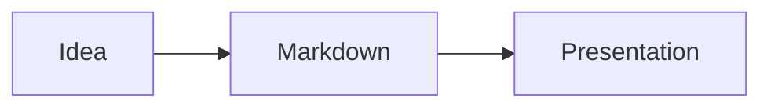

# Anna.js

A Markdown-first presentation framework for the web. Terminal animations, live code, Mermaid diagrams, AI generation, embed mode, and 12 themes.

## Installation

```bash
npm install -g anna.js
```

## Quick Start

```bash
anna init my-presentation          # scaffold a new project
anna generate slides.md            # generate HTML from Markdown
anna generate slides.md --watch    # regenerate on changes
anna ai "Intro to Kubernetes"      # AI-generated presentation
anna export slides.md              # export to PDF
```

## Example

`````markdown
---
title: My Presentation
theme: moon
transition: slide
---

# Welcome

---

## Fragments

<!-- .fragments -->
- Revealed one at a time
- Using arrow keys

--

### Vertical sub-slide

---



---

```terminal
$ anna init demo
  ✓ Created slides.md

$ anna generate slides.md
  ✓ slides.md → slides.html
```

---

```playground
console.log("Hello, Anna.js!");
```

---

<!-- .slide: data-background="#4d7e65" -->

## Custom Background

---

Note:
Speaker notes — press S to open.

---

# Thanks!
`````

## Syntax

| Syntax | Function |
|---|---|
| `---` | Horizontal slide separator |
| `--` | Vertical slide separator |
| `<!-- .fragments -->` | Animate each list item |
| `<!-- .fragment -->` | Make paragraph a fragment |
| `<!-- .slide: data-background="#hex" -->` | Background color |
| `<!-- .slide: data-background-image="img.jpg" -->` | Background image |
| `` | Image (auto-scaled) |
| `Note:` | Speaker notes |
| ` ```terminal ` | Animated terminal with typing effect |
| ` ```mermaid ` | Diagrams (flowchart, sequence, gantt) |
| ` ```playground ` | Live code editor (JS, HTML, CSS) |

## Frontmatter

```yaml
---
title: Title
author: Name
theme: league        # 12 themes available
transition: slide    # slide, fade, convex, concave, zoom, none
controls: true
progress: true
center: true
hash: true
autoSlide: 0
loop: false
---
```

## Terminal Slides

Commands are typed out character by character. Each command group is a fragment step.

````markdown
```terminal
$ npm install anna.js
added 42 packages in 2.3s

$ anna generate slides.md
✓ slides.md → slides.html
```
````

## Live Code Playground

Runnable code directly in slides — perfect for workshops and tutorials. Ctrl+Enter to run.

````markdown
```playground
const name = "Anna";
console.log(`Hello, ${name}!`);
```

```playground html
<h1 style="color: coral">Hello!</h1>
```
````

Supports JavaScript, HTML, and CSS. Sandboxed execution.

## Mermaid Diagrams

Flowcharts, sequence diagrams, gantt charts, and more. Theme auto-matches your presentation.

````markdown

````

Requires internet (Mermaid loaded from CDN).

## AI Generation

Generate a complete presentation from an outline or topic:

```bash
anna ai outline.txt
anna ai "Introduction to Kubernetes" --theme moon
```

Uses the Claude API. Requires `ANTHROPIC_API_KEY` and `npm install @anthropic-ai/sdk`.

## Speaker View

Press **S** for an enhanced speaker view:

- **Countdown timer** — green/yellow/red, pulses on overtime
- **Per-slide timing** — real-time tracking
- **Next slide preview**
- **Progress bar** — slide X of Y
- **Three layouts** — Default, Wide, Notes-only

Timer and layout persist via localStorage.

## Embed Mode

Slides as web components for blog posts and documentation:

```html
<script src="https://unpkg.com/anna.js/js/anna-embed.js"></script>

<anna-slide theme="moon">
  ## Hello World
  - Point 1
  - Point 2
</anna-slide>

<anna-deck theme="night">
  <anna-slide># Slide 1</anna-slide>
  <anna-slide># Slide 2</anna-slide>
</anna-deck>
```

Shadow DOM, all 11 themes, fragments, and keyboard navigation. One `<script>` tag.

## Themes

**Dark:** black, night, moon, blood, league (default)
**Light:** white, beige, sky, serif, simple, solarized

## Keyboard Shortcuts

| Key | Function |
|---|---|
| Arrow keys | Navigate between slides |
| Space / N | Next slide |
| P | Previous slide |
| ESC / O | Slide overview |
| S | Speaker notes |
| F | Fullscreen |
| B / . | Pause (black screen) |

## Development

```bash
npm install
npm run build     # compile SCSS + minify CSS/JS
npm start         # dev server with livereload
npm test          # lint + 32 tests
```

## Plugins

markdown, highlight, notes, math, search, zoom, multiplex, terminal, mermaid, playground

## License

MIT - Made with ❤️ from Knut W. Horne ([kwhorne.com](https://kwhorne.com))
