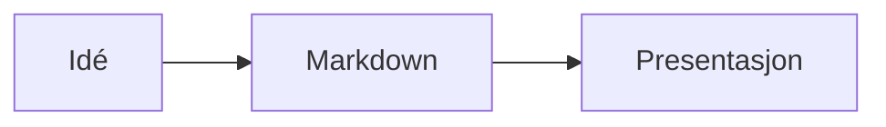
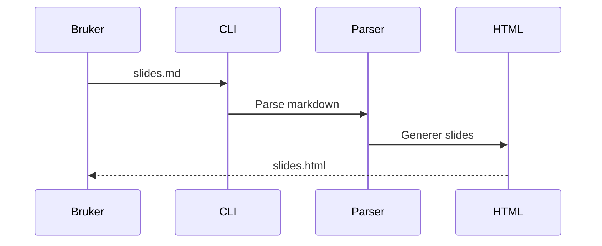

# Anna.js

Et presentasjonsrammeverk for web med Markdown-first workflow. Skriv slides i Markdown med innebygd støtte for diagrammer, animerte terminaler, fragmenter og 12 temaer.

## Installasjon

```bash
npm install -g anna.js
```

Eller bruk direkte med `npx`:

```bash
npx anna init my-presentation
```

## Kom i gang

```bash
anna init my-presentation          # nytt prosjekt med alle filer
anna generate slides.md            # generer HTML fra Markdown
anna generate slides.md --watch    # regenerer ved endringer
anna export slides.md              # eksporter til PDF (krever puppeteer)
```

## Eksempel

`````markdown
---
title: Min presentasjon
theme: moon
transition: slide
---

# Velkommen

Første slide

---

## Fragmenter

<!-- .fragments -->
- Punkt som vises ett om gangen
- Med piltaster eller mellomrom
- Perfekt for lister

--

### Vertikal sub-slide

Bruk `--` for vertikale slides

---

## Diagrammer



---

## Terminal

```terminal
$ anna init demo
  ✓ Created slides.md
  ✓ Generated slides.html

$ anna generate slides.md --watch
  ✓ slides.md → slides.html
  Watching slides.md for changes...
```

---

<!-- .slide: data-background="#4d7e65" -->

## Bakgrunner

Farger, bilder og gradienter via slide-attributter

---


---

## Speaker Notes

Trykk **S** for speaker-vindu.

Note:
Disse notatene ser bare presentatøren.

---

# Takk!
`````

## Syntaks

| Syntaks | Funksjon |
|---|---|
| `---` | Horisontal slide-separator |
| `--` | Vertikal slide-separator |
| `<!-- .fragments -->` | Animerer hvert listepunkt |
| `<!-- .fragment -->` | Gjør paragraf til fragment |
| `<!-- .slide: data-background="#hex" -->` | Bakgrunnsfarge |
| `<!-- .slide: data-background-image="img.jpg" -->` | Bakgrunnsbilde |
| `` | Bilde (auto-skalert til slide) |
| `Note:` | Speaker notes (synlig med **S**) |
| ````terminal ` | Animert terminal med typing-effekt |
| ````mermaid ` | Diagrammer (flowchart, sekvens, gantt, etc.) |

## Frontmatter

```yaml
---
title: Tittel
author: Navn
theme: league        # 12 temaer tilgjengelig
transition: slide    # slide, fade, convex, concave, zoom, none
controls: true
progress: true
center: true
hash: true
autoSlide: 0
loop: false
---
```

## Terminal-slides

Kommandoer types ut karakter for karakter. Output vises etter typing. Hvert kommando-par er et fragment-steg.

````markdown
```terminal
$ npm install anna.js
added 42 packages in 2.3s

$ anna generate slides.md
✓ slides.md → slides.html
```
````

## Mermaid-diagrammer

Flowcharts, sekvensdiagrammer, gantt-charts og mer. Tema tilpasses automatisk til mørke/lyse Anna.js-temaer. Krever internett (lastes fra CDN).

````markdown

````

## Temaer

**Mørke:** black, night, moon, blood, league (standard)
**Lyse:** white, beige, sky, serif, simple, solarized

I Markdown — sett `theme` i frontmatter. I HTML:

```html
<link rel="stylesheet" href="css/theme/moon.css">
```

## Keyboard shortcuts

| Tast | Funksjon |
|---|---|
| Piltaster | Naviger mellom slides |
| Space / N | Neste slide |
| P | Forrige slide |
| ESC / O | Slide-oversikt |
| S | Speaker notes |
| F | Fullskjerm |
| B / . | Pause (svart skjerm) |

## Utvikling

```bash
npm install
npm run build     # kompiler SCSS + minifiser CSS/JS
npm start         # utviklingsserver med livereload
npm test          # lint + 24 tester
```

## Plugins

markdown, highlight, notes, math, search, zoom, multiplex, terminal, mermaid

## Lisens

MIT — Knut W. Horne ([kwhorne.com](https://kwhorne.com))
