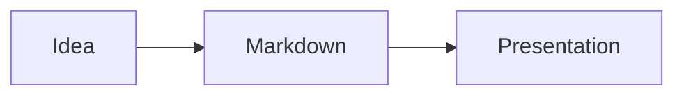
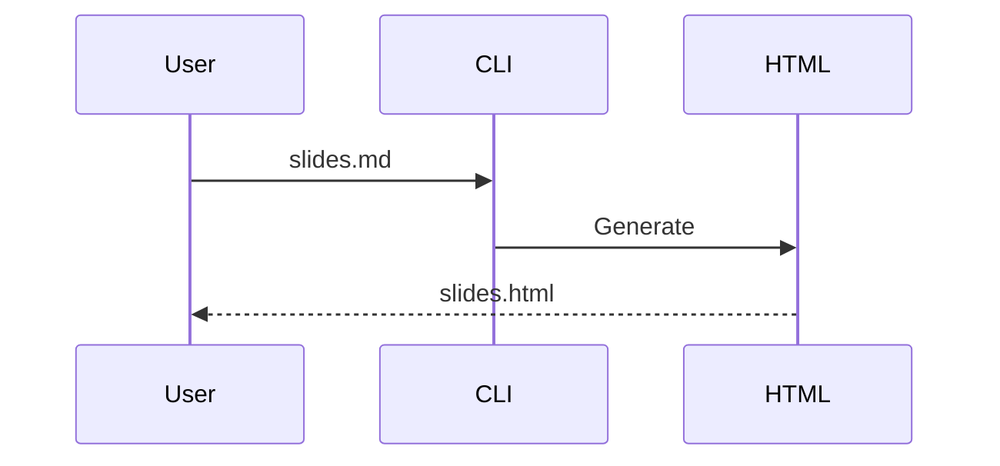
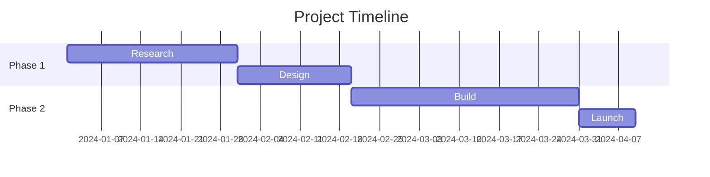

# Anna.js Documentation

> **Version 1.0.0** · A Markdown-first presentation framework for the web.

Anna.js turns Markdown files into beautiful, interactive HTML presentations with terminal animations, live code playgrounds with syntax highlighting, Mermaid diagrams, AI-powered generation, live audience interaction, offline PWA support, and 11 built-in themes.

---

## Table of Contents

- [Installation](#installation)
- [Quick Start](#quick-start)
- [CLI Reference](#cli-reference)
  - [anna init](#anna-init)
  - [anna generate](#anna-generate)
  - [anna serve](#anna-serve)
  - [anna export](#anna-export)
  - [anna ai](#anna-ai)
  - [anna ai refine](#anna-ai-refine)
  - [anna ai translate](#anna-ai-translate)
  - [anna live](#anna-live)
- [Markdown Syntax](#markdown-syntax)
  - [Slide Separators](#slide-separators)
  - [Frontmatter](#frontmatter)
  - [Fragments](#fragments)
  - [Slide Attributes](#slide-attributes)
  - [Speaker Notes](#speaker-notes)
  - [Images](#images)
- [Terminal Slides](#terminal-slides)
- [Live Code Playground](#live-code-playground)
  - [Multi-file Playground](#multi-file-playground)
  - [Step-by-step Code](#step-by-step-code)
  - [Enhanced Console](#enhanced-console)
- [Mermaid Diagrams](#mermaid-diagrams)
- [Offline & PWA](#offline--pwa)
- [Dev Server](#dev-server)
- [Anna Live](#anna-live-1)
  - [Live Polls](#live-polls)
  - [Live Q&A](#live-qa)
  - [Emoji Reactions](#emoji-reactions)
- [PDF Export](#pdf-export)
- [Speaker View](#speaker-view)
- [Embed Mode](#embed-mode)
  - [anna-slide Element](#anna-slide-element)
  - [anna-deck Element](#anna-deck-element)
  - [Embed Fragment Syntax](#embed-fragment-syntax)
- [Themes](#themes)
  - [Theme Reference Table](#theme-reference-table)
- [Plugins](#plugins)
  - [Markdown](#markdown-plugin)
  - [Highlight](#highlight-plugin)
  - [Notes](#notes-plugin)
  - [Terminal](#terminal-plugin)
  - [Playground](#playground-plugin)
  - [Mermaid](#mermaid-plugin)
  - [Math](#math-plugin)
  - [Search](#search-plugin)
  - [Zoom](#zoom-plugin)
  - [Multiplex](#multiplex-plugin)
  - [Live](#live-plugin)
- [JavaScript API](#javascript-api)
  - [Anna.initialize()](#annainitialize)
  - [Configuration Reference](#configuration-reference)
  - [Navigation Methods](#navigation-methods)
  - [Fragment Methods](#fragment-methods)
  - [State & Layout Methods](#state--layout-methods)
  - [Toggle Methods](#toggle-methods)
  - [Getter Methods](#getter-methods)
  - [Event Methods](#event-methods)
  - [Key Binding Methods](#key-binding-methods)
  - [Plugin Methods](#plugin-methods)
  - [Dependency Loading](#dependency-loading)
- [Events](#events)
- [Keyboard Shortcuts](#keyboard-shortcuts)
- [Project Structure](#project-structure)
- [Development](#development)
- [License](#license)

---

## Installation

Install Anna.js globally via npm:

```bash
npm install -g anna.js
```

Or use it locally in a project:

```bash
npm install anna.js
npx anna --help
```

### Requirements

- **Node.js** ≥ 16.7.0
- **Optional:** `@anthropic-ai/sdk` for AI features (`npm install @anthropic-ai/sdk`)
- **Optional:** `puppeteer` for PDF export (`npm install puppeteer`)

---

## Quick Start

```bash
# Scaffold a new presentation project
anna init my-presentation

# Edit slides in Markdown
cd my-presentation
edit slides.md

# Generate HTML
anna generate slides.md

# Start dev server with live reload
anna serve slides.md --open

# Generate with AI
anna ai "Introduction to Kubernetes"

# Export to PDF
anna export slides.md
```

---

## CLI Reference

The Anna.js CLI provides six core commands. Run `anna --help` for an overview or `anna <command> --help` for command-specific options.

### anna init

Scaffold a new presentation project with all necessary assets.

```bash
anna init [name]
```

| Option | Description |
|--------|-------------|
| `[name]` | Directory name to create. If omitted, uses the current directory. |
| `--help`, `-h` | Show help |

**What it creates:**

- `slides.md` — Starter Markdown presentation
- `slides.html` — Generated HTML
- `css/` — Anna.js stylesheets and themes
- `js/` — Anna.js core JavaScript
- `lib/` — Third-party libraries (fonts, highlight.js themes)
- `plugin/` — All Anna.js plugins

**Example:**

```bash
anna init my-talk
cd my-talk
open slides.html
```

---

### anna generate

Convert a Markdown file into a standalone HTML presentation.

```bash
anna generate <input.md> [output.html] [options]
```

| Option | Description |
|--------|-------------|
| `[output.html]` | Output filename. Defaults to `<input>.html`. |
| `--watch`, `-w` | Watch for changes and regenerate automatically |
| `--offline` | Download and bundle Mermaid locally for offline use |
| `--pwa` | Generate PWA files (`manifest.json`, `sw.js`) |
| `--help`, `-h` | Show help |

**Examples:**

```bash
anna generate slides.md                        # → slides.html
anna generate slides.md presentation.html      # custom output name
anna generate slides.md --watch                # regenerate on save
anna generate slides.md --offline --pwa        # full offline PWA
```

**Shorthand:** You can omit the `generate` keyword:

```bash
anna slides.md                                 # same as anna generate slides.md
```

---

### anna serve

Start a development server with automatic live reload.

```bash
anna serve <input.md> [options]
```

| Option | Description |
|--------|-------------|
| `--port`, `-p <number>` | Port to listen on (default: `3000`) |
| `--open`, `-o` | Automatically open the browser |
| `--help`, `-h` | Show help |

**How it works:**

1. Builds the presentation from Markdown using `generate`
2. Starts an Express HTTP server serving the generated HTML at `/`
3. Serves all Anna.js static assets (`css/`, `js/`, `lib/`, `plugin/`)
4. Serves local files (images, etc.) from the Markdown file's directory
5. Watches the `.md` file for changes with 150ms debouncing
6. On change, rebuilds and pushes a reload signal via Server-Sent Events (SSE)
7. A small injected script in the browser listens for SSE messages and calls `location.reload()`

No browser extension required. Gracefully shuts down on `Ctrl+C`.

**Examples:**

```bash
anna serve slides.md                           # http://localhost:3000
anna serve slides.md --port 8080               # http://localhost:8080
anna serve slides.md --open                    # auto-opens browser
```

---

### anna live

Start a live presentation server with real-time audience interaction.

```bash
anna live <input.md> [options]
```

| Option | Description |
|--------|-------------|
| `--port`, `-p <number>` | Port to listen on (default: `4000`) |
| `--open`, `-o` | Automatically open the browser |
| `--help`, `-h` | Show help |

**Routes:**

| Route | Description |
|-------|-------------|
| `/` | Presenter view — full presentation with live plugin injected |
| `/audience` | Audience view — mobile-friendly page with polls, Q&A, and reactions |
| `/qr` | QR code page for sharing the audience URL |
| `/api/state` | JSON endpoint with current server state |

**How it works:**

1. Builds the presentation from Markdown
2. Starts an Express + Socket.IO server
3. Injects the live plugin into the presenter view
4. Generates a standalone audience page with current slide tracking
5. Manages polls, Q&A, and reactions via Socket.IO events
6. Watches the `.md` file and rebuilds on changes

**Socket.IO events managed:**
- `poll-vote` — one vote per session per poll
- `qa-question` — new question submission
- `qa-upvote` — one upvote per session per question
- `reaction` — emoji reactions (batched in 500ms windows)
- `slide-changed` — syncs audience view with presenter

**Examples:**

```bash
anna live slides.md                # http://localhost:4000
anna live slides.md --port 8080   # http://localhost:8080
anna live slides.md --open        # auto-opens browser
```

---

### anna export

Export a presentation to PDF using Puppeteer.

```bash
anna export <input.md|input.html> [output.pdf]
```

| Option | Description |
|--------|-------------|
| `[output.pdf]` | Output filename. Defaults to `<input>.pdf`. |
| `--help`, `-h` | Show help |

**Requirements:** Install Puppeteer first:

```bash
npm install puppeteer
```

**How it works:**

1. If input is `.md`, generates a temporary HTML file first
2. Starts a local HTTP server to avoid CORS issues with `file://` URLs
3. Opens the presentation in headless Chromium with `?print-pdf` mode
4. Waits for Anna.js to initialize and lay out the print-pdf slides
5. Exports to PDF with `960×700px` page dimensions and background printing
6. Cleans up temporary files

**Examples:**

```bash
anna export slides.md                          # → slides.pdf
anna export slides.html output.pdf             # from HTML, custom name
```

---

### anna ai

Generate a complete presentation from a topic or outline file using the Claude API.

```bash
anna ai <outline.txt|"topic"> [options]
```

| Option | Description |
|--------|-------------|
| `-o`, `--output <file>` | Output Markdown file (default: auto-generated from topic) |
| `--theme <name>` | Override the AI's theme selection |
| `--lang <code>` | Language hint (e.g., `en`, `no`, `ja`) |
| `--help`, `-h` | Show help |

**Requirements:**

```bash
npm install @anthropic-ai/sdk
export ANTHROPIC_API_KEY="your-key-here"
```

The AI generates 8–15 slides with YAML frontmatter, fragments, Mermaid diagrams, terminal blocks, speaker notes, and a fitting theme. It writes both a `.md` and `.html` file.

**Examples:**

```bash
anna ai "Introduction to Kubernetes"           # → introduction-to-kubernetes.md + .html
anna ai outline.txt                            # → outline-slides.md + .html
anna ai "GraphQL vs REST" --theme moon         # force moon theme
anna ai notes.txt --lang no                    # generate in Norwegian
```

---

### anna ai refine

Improve an existing presentation using AI analysis.

```bash
anna ai refine <file.md> [options]
```

| Option | Description |
|--------|-------------|
| `-o`, `--output <file>` | Output file (default: `<input>-refined.md`) |
| `--help`, `-h` | Show help |

**What it improves:**

- **Visual balance** — Splits text-heavy slides, consolidates thin ones
- **Speaker notes** — Adds `Note:` blocks to slides that lack them
- **Fragment pacing** — Adds `<!-- .fragments -->` where step-by-step reveal would work better
- **Theme & transition** — Suggests better choices if the current ones don't fit
- **Mermaid diagrams** — Simplifies overly complex diagrams, fixes syntax
- **Terminal blocks** — Ensures commands are realistic and well-formatted
- **Slide flow** — Improves the narrative arc from introduction to conclusion
- **Formatting** — Consistent use of bold, italic, and headings

**Examples:**

```bash
anna ai refine slides.md                       # → slides-refined.md + .html
anna ai refine slides.md -o slides-v2.md       # custom output name
```

---

### anna ai translate

Translate a presentation to another language while preserving all syntax.

```bash
anna ai translate <file.md> --lang <target> [options]
```

| Option | Description |
|--------|-------------|
| `--lang <code>` | **Required.** Target language code (e.g., `en`, `no`, `ja`, `de`) |
| `-o`, `--output <file>` | Output file (default: `<input>-<lang>.md`) |
| `--help`, `-h` | Show help |

**What it preserves:**

- All Markdown and Anna.js syntax (separators, directives, frontmatter keys)
- Code block markers and language tags
- Mermaid diagram syntax (translates node labels only)
- Terminal commands (translates comments only)
- Technical terms where translation would cause confusion

**What it translates:**

- Slide titles, bullet points, paragraphs
- Speaker notes content (keeps the `Note:` prefix in English)
- Mermaid diagram node labels
- Frontmatter values (`title`, `author`)

**Examples:**

```bash
anna ai translate slides.md --lang en          # → slides-en.md + .html
anna ai translate slides.md --lang ja -o jp.md # Japanese, custom output
```

---

## Markdown Syntax

Anna.js uses standard Markdown with a few extensions for presentations.

### Slide Separators

| Syntax | Function |
|--------|----------|
| `---` | Horizontal slide separator (on its own line) |
| `--` | Vertical slide separator (sub-slides, navigate with ↓) |

**Example:**

````markdown
# Slide 1

---

# Slide 2

--

## Slide 2a (vertical)

--

## Slide 2b (vertical)

---

# Slide 3
````

> **Note:** `---` and `--` inside fenced code blocks are protected and won't create new slides.

---

### Frontmatter

YAML frontmatter at the top of your Markdown file configures the presentation:

```yaml
---
title: My Presentation
author: Your Name
theme: moon
transition: slide
controls: true
progress: true
center: true
hash: true
autoSlide: 0
loop: false
---
```

| Key | Default | Description |
|-----|---------|-------------|
| `title` | `Anna.js Presentation` | Document title (`<title>` tag) |
| `author` | *(none)* | Author meta tag |
| `theme` | `league` | Visual theme (see [Themes](#themes)) |
| `transition` | `slide` | Slide transition effect: `none`, `fade`, `slide`, `convex`, `concave`, `zoom` |
| `controls` | `true` | Show navigation arrows |
| `progress` | `true` | Show progress bar |
| `center` | `true` | Vertically center slide content |
| `hash` | `true` | Add current slide to URL hash |
| `autoSlide` | `0` | Auto-advance interval in ms (`0` = disabled) |
| `loop` | `false` | Loop back to first slide after last |

---

### Fragments

Fragments reveal content step-by-step when advancing.

#### Fragment Lists

Add `<!-- .fragments -->` before a list to animate each item:

````markdown
<!-- .fragments -->
- First item appears
- Then this one
- And finally this
````

With a specific animation effect:

````markdown
<!-- .fragments fade-up -->
- Fades up
- One by one
````

#### Fragment Paragraphs

Add `<!-- .fragment -->` after a paragraph:

````markdown
This paragraph appears as a fragment.
<!-- .fragment -->

This one highlights in red.
<!-- .fragment highlight-red -->
````

#### Available Fragment Effects

| Class | Effect |
|-------|--------|
| *(default)* | Fade in |
| `fade-up` | Slide up while fading in |
| `fade-down` | Slide down while fading in |
| `fade-left` | Slide left while fading in |
| `fade-right` | Slide right while fading in |
| `fade-in-then-out` | Fades in, then fades out on next step |
| `fade-in-then-semi-out` | Fades in, then partially fades on next step |
| `grow` | Scale up |
| `shrink` | Scale down |
| `strike` | Strikethrough text |
| `highlight-red` | Text turns red |
| `highlight-green` | Text turns green |
| `highlight-blue` | Text turns blue |
| `highlight-current-red` | Text turns red, resets on next step |
| `highlight-current-green` | Text turns green, resets on next step |
| `highlight-current-blue` | Text turns blue, resets on next step |

---

### Slide Attributes

Set per-slide HTML attributes using an HTML comment:

````markdown
<!-- .slide: data-background="#4d7e65" -->

## Green Background Slide
````

**Common attributes:**

| Attribute | Example | Description |
|-----------|---------|-------------|
| `data-background` | `"#4d7e65"` | Solid background color |
| `data-background-image` | `"img.jpg"` | Background image URL |
| `data-background-size` | `"cover"` | CSS background-size |
| `data-background-position` | `"center"` | CSS background-position |
| `data-background-repeat` | `"no-repeat"` | CSS background-repeat |
| `data-background-opacity` | `"0.5"` | Background opacity (0–1) |
| `data-background-video` | `"video.mp4"` | Background video URL |
| `data-background-video-loop` | `"true"` | Loop the background video |
| `data-background-video-muted` | `"true"` | Mute the background video |
| `data-transition` | `"zoom"` | Override transition for this slide |
| `data-transition-speed` | `"fast"` | Override transition speed |
| `data-state` | `"my-state"` | Add a class to `<body>` when this slide is active |
| `data-autoslide` | `"5000"` | Override auto-slide timing for this slide |

---

### Speaker Notes

Start speaker notes with `Note:` on its own line. Everything after it (until the next slide) becomes the note:

````markdown
## My Slide

Some public content.

Note:
These are speaker notes that only you see.
They can span multiple lines.

- Use them for reminders
- Talking points
- Timing cues
````

Press **S** during a presentation to open the speaker view.

---

### Images

Standard Markdown image syntax:

```markdown


```

Images are automatically scaled to fit within the slide dimensions.

---

## Terminal Slides

Terminal blocks render as animated macOS-style terminal widgets. Commands are typed character-by-character with a blinking cursor, and output appears after typing finishes.

````markdown
```terminal
$ npm install anna.js
added 42 packages in 2.3s

$ anna generate slides.md
✓ slides.md → slides.html
```
````

### How It Works

- Lines starting with `$` or `>` are recognized as **commands** and are typed out
- All other lines are **output** and appear immediately after the command finishes typing
- The first command group types automatically when the slide appears
- Each subsequent command group becomes a **fragment** — advance with arrow keys or spacebar
- Going backwards instantly resets the terminal to the previous state

### Configuration Attributes

| Attribute | Default | Description |
|-----------|---------|-------------|
| `data-typing-speed` | `40` | Milliseconds per character |
| `data-title` | `Terminal` | Text in the terminal title bar |

Set these in the generated HTML or via post-processing.

### Output Colorization

The terminal plugin automatically colorizes output lines containing:

| Pattern | Color | CSS Class |
|---------|-------|-----------|
| `✓` | Green | `.success` |
| `error` | Red | `.error` |
| `warning` | Amber | `.warning` |
| `→` | Blue | `.info` |

---

## Live Code Playground

Playground blocks create interactive code editors with built-in syntax highlighting, a Run button, and real-time output directly in your slides. Perfect for workshops and tutorials.

The editor uses a mirror technique — a transparent textarea on top of a syntax-highlighted overlay — providing colored tokens without any external dependencies.

````markdown
```playground
const name = "Anna";
console.log(`Hello, ${name}!`);
```
````

### Supported Languages

````markdown
```playground
// JavaScript (default)
console.log("Hello!");
```

```playground html
<h1 style="color: coral">Hello!</h1>
<p>HTML rendered in a sandboxed iframe</p>
```

```playground css
body {
  background: linear-gradient(135deg, #667eea, #764ba2);
  display: grid;
  place-items: center;
  height: 100vh;
}
h1 { color: white; font-size: 3em; }
```
````

| Language | Execution Method | Output |
|----------|-----------------|--------|
| `javascript` (default) | Sandboxed `new Function` with captured console | Console-style output pane |
| `html` | Rendered in a sandboxed `<iframe>` | Visual preview |
| `css` | Applied to an `<iframe>` with default HTML | Visual preview |

### Multi-file Playground

Edit JavaScript, HTML, and CSS in tabs with combined output:

````markdown
```playground multi
=== js
document.getElementById('msg').textContent = 'Hello!';
=== html
<div id="msg">Loading...</div>
=== css
#msg { color: coral; font-size: 2em; }
```
````

Use `=== js`, `=== html`, and `=== css` to separate sections. The output iframe renders the HTML with CSS applied and JS executed. Tabs in the editor header switch between files.

### Step-by-step Code

Build code incrementally across slides with visual diffs. Added lines are highlighted with a green left border:

````markdown
```playground step 1
const x = 1;
console.log(x);
```
````

On the next slide:

````markdown
```playground step 2
const x = 1;
const y = 2;
console.log(x + y);
```
````

The plugin uses an LCS-based diff algorithm to identify added lines. Diff highlighting clears automatically when the user starts editing.

For multiple independent step sequences, use `data-step-group`:

````markdown
```playground step 1 groupA
// First sequence, step 1
```

```playground step 1 groupB
// Second sequence, step 1
```
````

### Enhanced Console

The JavaScript playground captures these console methods:

| Method | Rendering |
|--------|-----------|
| `console.log()` | Standard output |
| `console.error()` | Red text |
| `console.warn()` | Amber text |
| `console.info()` | Blue text |
| `console.table(data)` | ASCII box-drawing table |
| `console.clear()` | Clears previous output |
| `console.group(label)` / `console.groupEnd()` | Indented grouping with `▸` label |

The return value of the last expression is displayed as `← value` in purple, similar to browser DevTools.

### Keyboard Shortcuts

| Key | Action |
|-----|--------|
| `Ctrl+Enter` / `Cmd+Enter` | Run code |
| `Tab` | Insert 2 spaces |
| `Shift+Tab` | Dedent |
| Multi-line selection + `Tab` | Indent all selected lines |
| Multi-line selection + `Shift+Tab` | Dedent all selected lines |

### Syntax Highlighting Tokens

The built-in tokenizer applies these Tokyo Night theme colors:

| Token | Color | Applies to |
|-------|-------|------------|
| `.token-keyword` | `#bb9af7` purple | `const`, `let`, `function`, `return`, `if`, `class`, etc. |
| `.token-string` | `#9ece6a` green | Single/double/template strings |
| `.token-number` | `#ff9e64` orange | Numeric literals |
| `.token-comment` | `#565f89` gray | `//` and `/* */` comments |
| `.token-operator` | `#89ddff` cyan | `=`, `+`, `=>`, etc. |
| `.token-function` | `#7aa2f7` blue | Function names |
| `.token-boolean` | `#ff9e64` orange | `true`, `false` |
| `.token-tag` | `#f7768e` red | HTML tags |
| `.token-attr-name` | `#bb9af7` purple | HTML attribute names |
| `.token-attr-value` | `#9ece6a` green | HTML attribute values |
| `.token-selector` | `#bb9af7` purple | CSS selectors |
| `.token-property` | `#7dcfff` cyan | CSS properties |
| `.token-value` | `#ff9e64` orange | CSS values |
| `.token-at-rule` | `#f7768e` red | CSS `@media`, `@keyframes`, etc. |

### Configuration Attributes

| Attribute | Default | Description |
|-----------|---------|-------------|
| `data-lang` | `javascript` | Language: `javascript`, `html`, `css`, or `multi` |
| `data-autorun` | `true` | Set to `"false"` to disable auto-run on load |
| `data-step` | *(none)* | Step number for step-by-step mode |
| `data-step-group` | *(none)* | Group name for independent step sequences |

---

## Mermaid Diagrams

Create flowcharts, sequence diagrams, gantt charts, and more using Mermaid syntax:

````markdown

````

````markdown

````

````markdown

````

### Theme Integration

Mermaid diagrams automatically match your presentation theme:

- **Dark themes** (black, night, moon, blood, league) → Mermaid `dark` theme
- **Light themes** (white, beige, sky, serif, simple, solarized) → Mermaid `default` theme

### Online vs. Offline

By default, Mermaid is loaded from the CDN (`https://cdn.jsdelivr.net/npm/mermaid@11`). For offline use, see [Offline & PWA](#offline--pwa).

---

## Offline & PWA

### Offline Mermaid

Bundle the Mermaid library locally so diagrams render without internet:

```bash
anna generate slides.md --offline
```

This downloads `mermaid.min.js` (≈3 MB) once to `lib/js/` and references it via a local `<script>` tag instead of the CDN ESM import. The file is cached — subsequent builds skip the download.

### Progressive Web App

Generate PWA files for an installable, offline-capable presentation:

```bash
anna generate slides.md --pwa
```

This creates two additional files next to the HTML output:

**`manifest.json`:**
- `name` and `short_name` from your frontmatter `title`
- `background_color` and `theme_color` derived from your theme
- `display: standalone` for app-like behavior
- `start_url: ./`

**`sw.js`** (Service Worker):
- **Cache-first strategy** — serves from cache, falls back to network
- Pre-caches all core assets: CSS, JS, plugins, and fonts
- Conditionally includes terminal, playground, and mermaid plugin files
- When combined with `--offline`, also caches the local Mermaid library

### Full Offline Mode

Combine both flags for a fully self-contained presentation:

```bash
anna generate slides.md --offline --pwa
```

The result can be installed as a standalone app on desktop or mobile and works completely without internet.

### Theme Colors

The PWA manifest and `<meta name="theme-color">` use these values:

| Theme | Color |
|-------|-------|
| black | `#191919` |
| white | `#fff` |
| league | `#2b5b84` |
| beige | `#f7f3de` |
| night | `#111` |
| moon | `#002b36` |
| blood | `#222` |
| serif | `#f0edde` |
| simple | `#fff` |
| solarized | `#fdf6e3` |
| sky | `#f7fbfc` |

---

## Dev Server

The `anna serve` command provides a zero-configuration development experience with instant feedback.

### Architecture

```
┌─────────────┐      fs.watch      ┌──────────────┐
│  slides.md  │ ──────────────────▶ │  Express App │
│  (Markdown) │     on change       │  port 3000   │
└─────────────┘                     └──────┬───────┘
                                           │
                              ┌────────────┼────────────┐
                              │            │            │
                         GET /        GET /css/*    GET /__anna_sse
                         (HTML)       (static)     (SSE stream)
                              │            │            │
                              ▼            ▼            ▼
                         ┌─────────────────────────────────┐
                         │           Browser(s)            │
                         │  EventSource → location.reload()│
                         └─────────────────────────────────┘
```

### Features

- **SSE-based reload** — No WebSocket dependency, no browser extension. Uses native `EventSource` API.
- **150ms debounce** — Prevents rapid successive rebuilds when editors auto-save frequently.
- **Static asset serving** — `css/`, `js/`, `lib/`, `plugin/` served from the Anna.js root.
- **Local file serving** — Images and other files from the Markdown file's directory.
- **Graceful shutdown** — Closes all SSE connections and the HTTP server on `SIGINT`.
- **Auto-reconnect** — If the SSE connection drops, the client retries after 1 second.

---

## Anna Live

Real-time audience interaction during presentations — polls, Q&A, and emoji reactions.

```bash
anna live slides.md               # start on port 4000
anna live slides.md --port 8080   # custom port
anna live slides.md --open        # auto-open browser
```

The live server provides three views:

| Route | Description |
|-------|-------------|
| `/` | Presenter view — full presentation with live widgets |
| `/audience` | Audience view — mobile-friendly polls, Q&A, and reactions |
| `/qr` | QR code page for sharing the audience URL |

### Live Polls

Add interactive polls to any slide:

````markdown
```poll What is your favorite language?
- JavaScript
- Python
- Rust
- Go
```
````

**Features:**
- Animated horizontal bar charts with real-time updates
- Five accent colors cycling through blue, green, purple, orange, and red
- One vote per person per poll (tracked by session ID)
- Results update instantly for all connected clients
- Votes persist in server memory for the duration of the session

### Live Q&A

Add a Q&A widget where the audience can submit and upvote questions:

````markdown
```qa Ask me anything!
```
````

**Features:**
- Text input for submitting questions
- Upvote button (▲) with count — one upvote per person per question
- Questions sorted by popularity (most upvotes first)
- Real-time updates as new questions arrive
- Scrollable list for long Q&A sessions

### Emoji Reactions

A floating reaction bar automatically appears at the bottom-right of the presentation:

**Available reactions:** 👍 ❤️ 😂 🎉 🤔

**Features:**
- Click to send a reaction
- Floating emoji animation rises from the bottom and fades out
- Reactions are batched in 500ms windows for performance
- Visible to all connected clients (presenter and audience)

### Architecture

The live server uses Express + Socket.IO:

- **Socket.IO lazy-loading** — The client plugin loads Socket.IO from CDN; gracefully no-ops if unavailable
- **Session management** — Random session ID per browser tab via `sessionStorage`
- **Reaction batching** — Multiple reactions within 500ms are aggregated into a single broadcast
- **Slide sync** — The audience view tracks the presenter's current slide
- **File watching** — Presenter view rebuilds automatically on Markdown changes

---

## PDF Export

Export presentations to PDF with faithful rendering:

```bash
anna export slides.md           # → slides.pdf
anna export slides.html out.pdf # from HTML
```

### How It Works

1. If the input is Markdown, a temporary HTML file is generated
2. A local HTTP server is started to serve the presentation (avoids CORS issues)
3. Puppeteer opens the presentation with `?print-pdf` in the URL
4. Anna.js lays out all slides in a print-friendly grid
5. A PDF is generated with `960×700px` page dimensions and background printing enabled
6. Temporary files are cleaned up

### Requirements

```bash
npm install puppeteer
```

Puppeteer is not bundled with Anna.js — it's loaded lazily with a helpful error message if missing.

---

## Speaker View

Press **S** during a presentation (or add `?notes` to the URL) to open the speaker view in a popup window.

### Features

- **Current slide** — Large preview of the active slide
- **Next slide preview** — See what's coming next
- **Speaker notes** — Your `Note:` content, formatted in HTML
- **Countdown timer** — Color-coded: green → yellow → red, pulses when overtime
- **Per-slide timing** — Real-time tracking of how long you spend on each slide
- **Progress bar** — Shows slide X of Y
- **Three layouts** — Default, Wide, and Notes-only modes

Timer state and layout preference persist in `localStorage` across sessions.

### Communication

The speaker view communicates with the main presentation via `window.postMessage`:

1. **Handshake:** The notes window connects to the main window
2. **State sync:** On every `slidechanged`, `fragmentshown`, `fragmenthidden`, `overviewshown`, `overviewhidden`, `paused`, and `resumed` event
3. **Remote control:** The notes window can call Anna.js API methods on the main window

---

## Embed Mode

Embed individual slides or full decks into any web page using Web Components:

```html
<script src="https://unpkg.com/anna.js/js/anna-embed.js"></script>
```

Zero dependencies. Shadow DOM for complete style encapsulation. One `<script>` tag.

### anna-slide Element

Renders a single Markdown slide:

```html
<anna-slide theme="moon">
  ## Hello World
  - Point 1
  - Point 2
</anna-slide>
```

| Attribute | Default | Description |
|-----------|---------|-------------|
| `theme` | `league` | Visual theme (all 11 themes supported) |

Content can be provided as text content or inside a `<template>` tag:

```html
<anna-slide theme="night">
  <template>
    ## Using Template
    Avoids HTML parsing issues with special characters.
  </template>
</anna-slide>
```

**Click behavior:** Clicking a standalone `<anna-slide>` advances its fragments.

### anna-deck Element

Wraps multiple slides into a navigable deck:

```html
<anna-deck theme="night">
  <anna-slide># Slide 1</anna-slide>
  <anna-slide># Slide 2</anna-slide>
  <anna-slide># Slide 3</anna-slide>
</anna-deck>
```

| Attribute | Default | Description |
|-----------|---------|-------------|
| `theme` | `league` | Theme applied to deck chrome and inherited by child slides |

**UI elements:**
- Previous/Next navigation buttons
- Dot indicators showing current position
- Slide counter (e.g., "2 / 5")

**Keyboard navigation** (when the deck is focused):

| Key | Action |
|-----|--------|
| `ArrowRight` / `Space` | Next (fragment first, then slide) |
| `ArrowLeft` | Previous (fragment first, then slide) |

Child `<anna-slide>` elements inherit the deck's theme unless they specify their own.

### Embed Fragment Syntax

In embed mode, use `{.fragment}` on list items:

```html
<anna-slide theme="moon">
  ## Step by Step
  - First item {.fragment}
  - Second item {.fragment}
  - Third item {.fragment}
</anna-slide>
```

> **Note:** This syntax (`{.fragment}`) differs from the main generator's syntax (`<!-- .fragments -->`). The embed component has its own built-in Markdown parser.

### Embed Markdown Support

The built-in parser supports:

| Syntax | Rendered As |
|--------|-------------|
| `# … ####` | Headings (h1–h4) |
| `- item` / `* item` | Unordered list |
| `1. item` | Ordered list |
| `` ``` code ``` `` | Fenced code block |
| `**bold**` | Bold |
| `*italic*` | Italic |
| `` `code` `` | Inline code |
| `[text](url)` | Link |
| `` | Image |
| Blank line | Paragraph break |

---

## Themes

Anna.js includes 11 built-in themes. Set the theme in your frontmatter:

```yaml
---
theme: moon
---
```

### Theme Reference Table

#### Dark Themes

| Theme | Background | Text | Headings | Links | Font |
|-------|-----------|------|----------|-------|------|
| **league** *(default)* | `#2b2b2b` dark gray | `#eee` | `#eee` | `#13DAEC` cyan | League Gothic + Lato |
| **black** | `#191919` near-black | `#fff` | `#fff` | `#42affa` sky blue | Source Sans Pro |
| **night** | `#111` near-black | `#eee` | `#eee` | `#e7ad52` amber | Open Sans + Montserrat |
| **moon** | `#002b36` solarized dark | `#93a1a1` | `#eee8d5` | `#268bd2` solarized blue | Lato |
| **blood** | `#222` coal | `#eee` | `#eee` | `#a23` blood red | Ubuntu |

#### Light Themes

| Theme | Background | Text | Headings | Links | Font |
|-------|-----------|------|----------|-------|------|
| **white** | `#fff` | `#222` | `#222` | `#2a76dd` blue | Source Sans Pro |
| **beige** | `#f7f3de` cream | `#333` | `#333` | `#8b743d` brown | League Gothic + Lato |
| **sky** | `#f7fbfc` ice white | `#333` | `#333` | `#3b759e` steel blue | Quicksand + Open Sans |
| **serif** | `#F0F1EB` off-white | `#000` | `#383D3D` | `#51483D` dark brown | Palatino Linotype |
| **simple** | `#fff` | `#000` | `#000` | `#00008B` dark blue | News Cycle + Lato |
| **solarized** | `#fdf6e3` solarized light | `#657b83` | `#586e75` | `#268bd2` solarized blue | Lato |

### Customizing Themes

Theme source files are in `css/theme/source/` as SCSS. Each theme imports a shared template and overrides variables:

```scss
// css/theme/source/my-theme.scss
$backgroundColor: #1a1a2e;
$mainColor: #e0e0e0;
$headingColor: #ffffff;
$linkColor: #e94560;
$mainFont: 'Inter', sans-serif;
$headingFont: 'Inter', sans-serif;

@import "../template/theme";
```

Build with:

```bash
npm run build:sass-themes
```

Available SCSS variables:

| Variable | Default | Description |
|----------|---------|-------------|
| `$backgroundColor` | `#2b2b2b` | Slide background color |
| `$bodyBackground` | `null` | Alternative body background (gradient, image) |
| `$mainFont` | `'Lato', sans-serif` | Body text font |
| `$mainFontSize` | `40px` | Base font size |
| `$mainColor` | `#eee` | Body text color |
| `$headingFont` | `'League Gothic', Impact` | Heading font |
| `$headingColor` | `#eee` | Heading text color |
| `$linkColor` | `#13DAEC` | Link color |
| `$linkColorHover` | `lighten($linkColor, 15%)` | Link hover color |
| `$blockMargin` | `20px` | Margin between block elements |
| `$headingTextShadow` | `none` | Text shadow on headings |
| `$headingTextTransform` | `uppercase` | Text transform on headings |
| `$selectionBackgroundColor` | `lighten($linkColor, 25%)` | Text selection highlight |

---

## Plugins

Anna.js includes 10 plugins. Most are loaded automatically via the `dependencies` array in the generated HTML.

### Markdown Plugin

**Files:** `plugin/markdown/marked.js`, `plugin/markdown/markdown.js`

Processes `<section data-markdown>` elements, enabling Markdown content directly in HTML slides. This is used internally by the generator.

---

### Highlight Plugin

**Files:** `plugin/highlight/highlight.js`

Provides syntax highlighting for code blocks using highlight.js v9.11.0 (bundled).

**Features:**
- Auto-highlights all `<pre><code>` blocks on load
- Supports `data-trim` to remove leading/trailing whitespace
- Supports `data-noescape` to prevent HTML escaping
- Supports `data-line-numbers` for line number display and highlighting

**Configuration** (via `Anna.initialize()`):

```javascript
Anna.initialize({
    // Inside highlight plugin config
    highlight: {
        highlightOnLoad: true,  // default
        escapeHTML: true         // default
    }
});
```

**Line number examples:**

```html
<pre><code data-line-numbers>
// All lines numbered
function hello() {
    return "world";
}
</code></pre>

<pre><code data-line-numbers="2,5-7">
// Lines 2, 5, 6, 7 highlighted
</code></pre>
```

**Public API:**
- `AnnaHighlight.init()` — Initialize the plugin
- `AnnaHighlight.highlightBlock(block)` — Highlight a specific code block
- `AnnaHighlight.highlightLines(block, lines)` — Emphasize specific lines

---

### Notes Plugin

**Files:** `plugin/notes/notes.js`, `plugin/notes/notes.html`

Adds the speaker notes feature.

**Activation:**
- Press **S** to open the speaker notes window
- Add `?notes` to the URL

**How notes are found:**
1. `<aside class="notes">` inside the slide
2. `data-notes` attribute on the `<section>`
3. Fragment notes (per-fragment `<aside class="notes">`)

**Communication:** Uses `window.postMessage` with a 3-step handshake (connect → connected → state sync).

**Public API:**
- `AnnaNotes.init()` — Bind S key and check for `?notes`
- `AnnaNotes.open(notesFilePath)` — Open the notes popup

---

### Terminal Plugin

**Files:** `plugin/terminal/terminal.js`, `plugin/terminal/terminal.css`

Renders animated terminal widgets. See [Terminal Slides](#terminal-slides) for full syntax documentation.

**Event integration:**
- `slidechanged` → Types the first command group
- `fragmentshown` → Types the next command group
- `fragmenthidden` → Resets to previous state

---

### Playground Plugin

**Files:** `plugin/playground/playground.js`, `plugin/playground/playground.css`

Renders live code editors. See [Live Code Playground](#live-code-playground) for full syntax documentation.

**Event integration:**
- Hooks into Anna `ready` event for initialization
- Stops keyboard events from propagating to Anna.js navigation

---

### Mermaid Plugin

**Files:** `plugin/mermaid/mermaid.css`

Provides CSS styling for Mermaid diagrams. The Mermaid JavaScript library itself is loaded from CDN (or locally with `--offline`). See [Mermaid Diagrams](#mermaid-diagrams).

**Key CSS:**
- Removes default `<pre>` styling (background, border, box-shadow)
- Centers diagrams and constrains to `max-width: 90%`, `max-height: 70vh`
- Print-friendly overrides

---

### Math Plugin

**Files:** `plugin/math/math.js`

Integrates MathJax for rendering mathematical equations.

**Configuration:**

```javascript
Anna.initialize({
    math: {
        mathjax: 'https://cdnjs.cloudflare.com/ajax/libs/mathjax/2.7.0/MathJax.js', // CDN URL
        config: 'TeX-AMS_HTML-full',  // MathJax config
        // All other properties forwarded to MathJax.Hub.Config()
    },
    dependencies: [
        { src: 'plugin/math/math.js', async: true }
    ]
});
```

**Default math delimiters:**
- Inline: `$...$` and `\(...\)`
- Display: `$$...$$` and `\[...\]`

**Behavior:**
- Typesets all content on load
- Re-typesets the current slide on `slidechanged`
- Calls `Anna.layout()` after typesetting to adjust dimensions

---

### Search Plugin

**Files:** `plugin/search/search.js`

Adds text search across all slides.

**Activation:** `Ctrl+Shift+F`

**Features:**
- Search box overlay with text input
- Highlights matches with colored `<em>` tags (Hilitor pattern)
- Press `Enter` to navigate to the next matching slide (wraps around)
- Tracks matching slides by horizontal/vertical index

**Public API:**
- `AnnaSearch.open()` — Open the search dialog

---

### Zoom Plugin

**Files:** `plugin/zoom-js/zoom.js`

Click-to-zoom on any element in a slide.

**Activation:** `Alt+Click` (or `Ctrl+Click` on Linux)

**Features:**
- Zooms using CSS `transform: translate() scale()` with 0.8s easing
- Auto-pans when the mouse approaches window edges while zoomed
- Press `Escape` to zoom out
- Adds `.zoomed` class to `<html>` when zoomed

**Configuration:**

```javascript
Anna.initialize({
    zoomKey: 'alt',   // modifier key ('alt' or 'ctrl')
    zoomLevel: 2,     // zoom scale factor
});
```

**Public API:**
- `zoom.to({ x, y, scale, pan, element })` — Zoom to a point or element
- `zoom.out()` / `zoom.reset()` — Zoom back to normal
- `zoom.magnify(options)` — Alias for `to()`
- `zoom.zoomLevel()` — Returns the current scale

---

### Multiplex Plugin

**Files:** `plugin/multiplex/index.js`, `plugin/multiplex/client.js`, `plugin/multiplex/master.js`

Real-time presentation synchronization — one presenter controls multiple viewers' slides simultaneously.

**Architecture:**
- **Server** (Node.js + Express + Socket.IO) listens on port `1948`
- **Master** — The presenter's browser, sends state changes
- **Clients** — Viewer browsers, receive and apply state changes

**Server setup:**

```bash
node plugin/multiplex/index.js
```

**Endpoints:**
- `GET /` — Presentation or info page
- `GET /token` — Generate a `{ secret, socketId }` pair for authentication

**Authentication:** State changes are validated via Blowfish hash of the socket ID + secret.

---

### Live Plugin

**Files:** `plugin/live/live.js`, `plugin/live/live.css`

Real-time audience interaction — polls, Q&A, and emoji reactions. See [Anna Live](#anna-live-1) for full documentation.

**Activation:** Requires `Anna.getConfig().live` to be set (automatically configured by `anna live`).

**Configuration:**

```javascript
Anna.initialize({
    live: {
        url: 'http://localhost:4000',  // Socket.IO server URL
        mode: 'presenter'              // 'presenter' or 'audience'
    }
});
```

**Socket.IO events emitted:**
- `poll-vote` — `{ pollId, option, sessionId }`
- `qa-question` — `{ qaId, text, sessionId }`
- `qa-upvote` — `{ qaId, questionId, sessionId }`
- `reaction` — `{ emoji, slideIndex }`

**Socket.IO events received:**
- `poll-results` — `{ pollId, results, totalVotes }`
- `qa-questions` — `{ qaId, questions }`
- `reaction-burst` — `{ emoji, count }`

**Features:**
- Lazy-loads Socket.IO from CDN
- Graceful fallback if server is unreachable
- All click/keydown events stop propagation to avoid interfering with Anna.js navigation
- Session tracking via `sessionStorage` for duplicate vote prevention

---

## JavaScript API

Anna.js exposes a comprehensive API through the global `Anna` object. It works as a UMD module (AMD, CommonJS, or browser global).

### Anna.initialize()

Initialize the presentation with configuration options:

```javascript
Anna.initialize({
    controls: true,
    progress: true,
    center: true,
    hash: true,
    transition: 'slide',
    dependencies: [
        { src: 'plugin/markdown/marked.js' },
        { src: 'plugin/markdown/markdown.js' },
        { src: 'plugin/notes/notes.js', async: true },
        { src: 'plugin/highlight/highlight.js', async: true }
    ]
});
```

### Configuration Reference

#### Layout & Sizing

| Option | Type | Default | Description |
|--------|------|---------|-------------|
| `width` | `number` | `960` | Presentation width in pixels |
| `height` | `number` | `700` | Presentation height in pixels |
| `margin` | `number` | `0.04` | Empty margin factor around content |
| `minScale` | `number` | `0.2` | Minimum scale factor |
| `maxScale` | `number` | `2.0` | Maximum scale factor |
| `center` | `boolean` | `true` | Vertically center slides |
| `disableLayout` | `boolean` | `false` | Disable built-in slide layout |
| `display` | `string` | `'block'` | CSS display mode for slides |

#### Controls & UI

| Option | Type | Default | Description |
|--------|------|---------|-------------|
| `controls` | `boolean` | `true` | Show navigation arrows |
| `controlsTutorial` | `boolean` | `true` | Bounce arrows on first vertical slide |
| `controlsLayout` | `string` | `'bottom-right'` | `'edges'` or `'bottom-right'` |
| `controlsBackArrows` | `string` | `'faded'` | `'faded'`, `'hidden'`, or `'visible'` |
| `progress` | `boolean` | `true` | Show progress bar |
| `slideNumber` | `boolean\|string\|function` | `false` | Slide number display format |
| `showSlideNumber` | `string` | `'all'` | `'all'`, `'print'`, or `'speaker'` |
| `help` | `boolean` | `true` | Show help overlay on `?` |
| `showNotes` | `boolean\|string` | `false` | Show notes to all viewers; `'inline'` embeds them |
| `hideInactiveCursor` | `boolean` | `true` | Auto-hide mouse cursor |
| `hideCursorTime` | `number` | `5000` | Milliseconds before cursor hides |

#### Navigation & Behavior

| Option | Type | Default | Description |
|--------|------|---------|-------------|
| `keyboard` | `boolean\|object` | `true` | Enable keyboard; object maps `keyCode → callback` |
| `keyboardCondition` | `function\|null` | `null` | Return `false` to block keyboard |
| `overview` | `boolean` | `true` | Enable overview mode |
| `touch` | `boolean` | `true` | Enable touch navigation |
| `loop` | `boolean` | `false` | Loop the presentation |
| `rtl` | `boolean` | `false` | Right-to-left direction |
| `navigationMode` | `string` | `'default'` | `'default'`, `'linear'`, or `'grid'` |
| `shuffle` | `boolean` | `false` | Randomize slide order on load |
| `fragments` | `boolean` | `true` | Enable/disable fragments globally |
| `fragmentInURL` | `boolean` | `false` | Include fragment index in URL hash |
| `mouseWheel` | `boolean` | `false` | Navigate via mouse wheel |
| `rollingLinks` | `boolean` | `false` | 3D roll effect on link hover |
| `previewLinks` | `boolean` | `false` | Open links in iframe overlay |

#### Hash & History

| Option | Type | Default | Description |
|--------|------|---------|-------------|
| `hash` | `boolean` | `false` | Add current slide to URL hash |
| `hashOneBasedIndex` | `boolean` | `false` | 1-based numbering in hash |
| `history` | `boolean` | `false` | Push each slide to browser history |

#### Embedding & Messaging

| Option | Type | Default | Description |
|--------|------|---------|-------------|
| `embedded` | `boolean` | `false` | Presentation runs in a limited area |
| `postMessage` | `boolean` | `true` | Expose API via `window.postMessage` |
| `postMessageEvents` | `boolean` | `false` | Relay all events to parent window |
| `focusBodyOnPageVisibilityChange` | `boolean` | `true` | Re-focus body for keyboard shortcuts |

#### Media & Iframes

| Option | Type | Default | Description |
|--------|------|---------|-------------|
| `autoPlayMedia` | `boolean\|null` | `null` | Auto-play media (`null` = honor `data-autoplay`) |
| `preloadIframes` | `boolean\|null` | `null` | Pre-load iframes (`null` = honor `data-preload`) |
| `viewDistance` | `number` | `3` | Slides to pre-load in each direction |

#### Auto-Slide

| Option | Type | Default | Description |
|--------|------|---------|-------------|
| `autoSlide` | `number` | `0` | Milliseconds per slide (`0` = disabled) |
| `autoSlideStoppable` | `boolean` | `true` | Pause auto-slide on user input |
| `autoSlideMethod` | `function\|null` | `null` | Custom advance function |
| `defaultTiming` | `number\|null` | `null` | Seconds per slide for pacing timer |
| `pause` | `boolean` | `true` | Allow blackout/pause |

#### Transitions

| Option | Type | Default | Description |
|--------|------|---------|-------------|
| `transition` | `string` | `'slide'` | `none`, `fade`, `slide`, `convex`, `concave`, `zoom` |
| `transitionSpeed` | `string` | `'default'` | `'default'`, `'fast'`, `'slow'` |
| `backgroundTransition` | `string` | `'fade'` | Same values as `transition` |

#### Parallax Background

| Option | Type | Default | Description |
|--------|------|---------|-------------|
| `parallaxBackgroundImage` | `string` | `''` | CSS image URL |
| `parallaxBackgroundSize` | `string` | `''` | CSS size (e.g., `'3000px 2000px'`) |
| `parallaxBackgroundRepeat` | `string` | `''` | CSS repeat value |
| `parallaxBackgroundPosition` | `string` | `''` | CSS position value |
| `parallaxBackgroundHorizontal` | `number\|null` | `null` | Pixels per horizontal step |
| `parallaxBackgroundVertical` | `number\|null` | `null` | Pixels per vertical step |

#### PDF Export

| Option | Type | Default | Description |
|--------|------|---------|-------------|
| `pdfMaxPagesPerSlide` | `number` | `Infinity` | Max PDF pages per slide |
| `pdfSeparateFragments` | `boolean` | `true` | Each fragment gets its own page |
| `pdfPageHeightOffset` | `number` | `-1` | Pixel offset for print differences |

#### Dependencies

| Option | Type | Default | Description |
|--------|------|---------|-------------|
| `dependencies` | `array` | `[]` | Scripts to load (see [Dependency Loading](#dependency-loading)) |

---

### Navigation Methods

| Method | Description |
|--------|-------------|
| `Anna.slide(h, v, f, o)` | Navigate to horizontal `h`, vertical `v`, fragment `f`, origin `o` |
| `Anna.left()` | Navigate left |
| `Anna.right()` | Navigate right |
| `Anna.up()` | Navigate up |
| `Anna.down()` | Navigate down |
| `Anna.prev()` | Previous slide (linear order) |
| `Anna.next()` | Next slide (linear order) |
| `Anna.navigateTo(h, v, f, o)` | Alias for `slide()` |

### Fragment Methods

| Method | Description |
|--------|-------------|
| `Anna.navigateFragment(index, offset)` | Go to a specific fragment index |
| `Anna.prevFragment()` | Previous fragment |
| `Anna.nextFragment()` | Next fragment |

### State & Layout Methods

| Method | Description |
|--------|-------------|
| `Anna.sync()` | Full re-sync of all slides, backgrounds, fragments, progress |
| `Anna.syncSlide(slide)` | Re-sync a single slide element |
| `Anna.syncFragments(slide)` | Re-sort fragments within a slide |
| `Anna.layout()` | Force recalculation of slide layout and scaling |
| `Anna.shuffle()` | Randomize slide order |
| `Anna.configure(options)` | Update configuration after initialization |
| `Anna.getState()` | Returns `{ indexh, indexv, indexf, paused, overview }` |
| `Anna.setState(state)` | Restore a previously captured state |

### Toggle Methods

| Method | Description |
|--------|-------------|
| `Anna.toggleHelp(override?)` | Show/hide help overlay |
| `Anna.toggleOverview(override?)` | Show/hide overview mode |
| `Anna.togglePause(override?)` | Pause/resume (blackout) |
| `Anna.toggleAutoSlide(override?)` | Pause/resume auto-slide |

### Getter Methods

| Method | Returns | Description |
|--------|---------|-------------|
| `Anna.isReady()` | `boolean` | Whether initialization is complete |
| `Anna.isOverview()` | `boolean` | In overview mode |
| `Anna.isPaused()` | `boolean` | Presentation is paused |
| `Anna.isAutoSliding()` | `boolean` | Auto-slide is active |
| `Anna.isSpeakerNotes()` | `boolean` | Running in speaker notes window |
| `Anna.isFirstSlide()` | `boolean` | On the first slide |
| `Anna.isLastSlide()` | `boolean` | On the last slide |
| `Anna.isLastVerticalSlide()` | `boolean` | On last slide of current stack |
| `Anna.getIndices(slide?)` | `{ h, v, f }` | Indices of current or given slide |
| `Anna.getSlides()` | `Element[]` | All slide elements |
| `Anna.getSlidesAttributes()` | `Object[]` | Attribute maps for every slide |
| `Anna.getTotalSlides()` | `number` | Total slide count |
| `Anna.getSlide(h, v?)` | `Element` | Slide element at index |
| `Anna.getSlideBackground(h, v?)` | `Element` | Background element at index |
| `Anna.getSlideNotes(slide?)` | `string\|null` | Speaker notes for a slide |
| `Anna.getPreviousSlide()` | `Element\|null` | Previous slide element |
| `Anna.getCurrentSlide()` | `Element` | Current slide element |
| `Anna.getScale()` | `number` | Current content scale factor |
| `Anna.getConfig()` | `Object` | Current configuration object |
| `Anna.getQueryHash()` | `Object` | Parsed query string |
| `Anna.getAnnaElement()` | `Element` | Top-level `.anna` wrapper node |
| `Anna.getPlugins()` | `Object` | All registered plugins |
| `Anna.getProgress()` | `number` | Progress (0–1) |
| `Anna.getSlidePastCount()` | `number` | Slides before current |
| `Anna.availableRoutes()` | `{ left, right, up, down }` | Available navigation directions |
| `Anna.availableFragments()` | `{ prev, next }` | Whether prev/next fragments exist |
| `Anna.VERSION` | `string` | `'3.8.0'` |

### Event Methods

| Method | Description |
|--------|-------------|
| `Anna.addEventListener(type, listener, useCapture)` | Bind to the Anna wrapper element |
| `Anna.removeEventListener(type, listener, useCapture)` | Unbind from the Anna wrapper element |
| `Anna.addEventListeners()` | Re-attach all internal listeners |
| `Anna.removeEventListeners()` | Detach all internal listeners |

### Key Binding Methods

| Method | Description |
|--------|-------------|
| `Anna.addKeyBinding(binding, callback)` | Register a custom key binding |
| `Anna.removeKeyBinding(keyCode)` | Remove a custom key binding |
| `Anna.registerKeyboardShortcut(key, value)` | Add a label to the help overlay |
| `Anna.triggerKey(keyCode)` | Programmatically fire a keyboard event |

The `binding` parameter can be a keyCode integer or an object:

```javascript
Anna.addKeyBinding({ keyCode: 84, key: 'T', description: 'Toggle timer' }, () => {
    // Custom action
});
```

### Plugin Methods

| Method | Description |
|--------|-------------|
| `Anna.registerPlugin(id, plugin)` | Register a plugin (must have `.init()` method) |
| `Anna.hasPlugin(id)` | Check if a plugin is registered |
| `Anna.getPlugin(id)` | Retrieve a plugin by ID |

### Dependency Loading

Dependencies are loaded during initialization via the `dependencies` array:

```javascript
Anna.initialize({
    dependencies: [
        { src: 'plugin/markdown/marked.js' },
        { src: 'plugin/markdown/markdown.js' },
        { src: 'plugin/notes/notes.js', async: true },
        { src: 'plugin/highlight/highlight.js', async: true },
        {
            src: 'plugin/math/math.js',
            async: true,
            condition: function() { return !!document.querySelector('[data-math]'); }
        }
    ]
});
```

Each dependency object supports:

| Property | Type | Description |
|----------|------|-------------|
| `src` | `string` | Script URL to load |
| `async` | `boolean` | If `true`, loads after sync dependencies |
| `condition` | `function` | If it returns falsy, the dependency is skipped |
| `callback` | `function` | Called after the script loads |

**Boot sequence:**

1. Synchronous dependencies load in order
2. `initPlugins()` — calls `.init()` on all registered plugins (waits for Promises)
3. Async dependencies load in parallel
4. `start()` — DOM setup, URL hash reading, `'ready'` event

---

## Events

All events fire on the `.anna` wrapper DOM element. Listen via `Anna.addEventListener()`:

```javascript
Anna.addEventListener('slidechanged', function(event) {
    console.log('Now on slide:', event.indexh, event.indexv);
});
```

| Event | Payload | When |
|-------|---------|------|
| `ready` | `{ indexh, indexv, currentSlide }` | After initialization is complete |
| `slidechanged` | `{ indexh, indexv, previousSlide, currentSlide, origin }` | Active slide changes |
| `fragmentshown` | `{ fragment, fragments }` | Fragment(s) became visible |
| `fragmenthidden` | `{ fragment, fragments }` | Fragment(s) became hidden |
| `overviewshown` | `{ indexh, indexv, currentSlide }` | Overview mode activated |
| `overviewhidden` | `{ indexh, indexv, currentSlide }` | Overview mode deactivated |
| `paused` | — | Presentation paused (blackout) |
| `resumed` | — | Presentation resumed |
| `resize` | `{ oldScale, scale, size }` | Presentation scale changed |
| `autoslidepaused` | — | Auto-slide paused by user input |
| `autoslideresumed` | — | Auto-slide resumed |
| `pdf-ready` | — | PDF layout complete |

**Custom state events:** Slides with `data-state="mystate"` dispatch `'mystate'` as an event when they become active, and add `mystate` as a class on `<body>`.

**PostMessage events:** When `postMessageEvents: true`, all events are relayed to the parent window as:

```javascript
{
    namespace: 'anna',
    eventName: 'slidechanged',
    state: { indexh: 0, indexv: 0, ... }
}
```

---

## Keyboard Shortcuts

### Built-in Shortcuts

| Key(s) | Action |
|--------|--------|
| `→` / `L` | Navigate right |
| `←` / `H` | Navigate left |
| `↓` / `J` | Navigate down |
| `↑` / `K` | Navigate up |
| `N` / `Space` / `Page Down` | Next slide |
| `P` / `Shift+Space` / `Page Up` | Previous slide |
| `Home` / `Cmd+←` / `Ctrl+←` | First slide |
| `End` / `Cmd+→` / `Ctrl+→` | Last slide |
| `F` | Enter fullscreen |
| `Esc` / `O` | Toggle overview mode |
| `S` | Open speaker notes |
| `B` / `V` / `.` / `;` | Toggle pause (blackout) |
| `A` | Toggle auto-slide |
| `?` | Show help overlay |
| `Ctrl+Shift+F` | Open search (search plugin) |
| `Alt+Click` | Zoom in (zoom plugin) |
| `Escape` | Zoom out (when zoomed) |

### Custom Key Bindings

Register custom shortcuts via the `keyboard` option:

```javascript
Anna.initialize({
    keyboard: {
        // Map keyCode to API method name
        38: 'prev',     // Up arrow → previous slide
        40: 'next',     // Down arrow → next slide

        // Map keyCode to custom function
        84: function() {
            console.log('T was pressed!');
        }
    }
});
```

Or use the runtime API:

```javascript
Anna.addKeyBinding(
    { keyCode: 84, key: 'T', description: 'Toggle timer' },
    function() { /* ... */ }
);
```

---

## Project Structure

```
anna/
├── cli/                        # CLI commands
│   ├── anna.js                 # Entry point & command router
│   ├── init.js                 # Project scaffolding
│   ├── generate.js             # Markdown → HTML generator
│   ├── serve.js                # Dev server with live reload
│   ├── live.js                 # Live server with audience interaction
│   ├── export.js               # PDF export via Puppeteer
│   └── ai.js                   # AI generation, refine, translate
├── css/
│   ├── anna.scss               # Core presentation styles
│   ├── anna.css                # Compiled CSS
│   ├── anna.min.css            # Minified CSS
│   ├── reset.css               # CSS reset
│   ├── print/                  # Print/PDF styles
│   │   ├── paper.css
│   │   └── pdf.css
│   └── theme/
│       ├── source/             # Theme SCSS source files
│       │   └── *.scss
│       ├── template/           # Shared theme template
│       │   ├── settings.scss   # Default variable definitions
│       │   └── theme.scss      # Theme mixin
│       └── *.css               # Compiled theme CSS
├── js/
│   ├── anna.js                 # Core presentation engine (UMD)
│   ├── anna.min.js             # Minified core
│   └── anna-embed.js           # Web Components for embedding
├── lib/
│   ├── css/
│   │   └── monokai.css         # Syntax highlighting theme
│   ├── font/                   # Web fonts
│   └── js/
│       └── mermaid.min.js      # Local Mermaid (created by --offline)
├── plugin/
│   ├── highlight/              # Syntax highlighting (bundled highlight.js)
│   ├── markdown/               # Markdown processing
│   ├── math/                   # MathJax integration
│   ├── mermaid/                # Mermaid diagram styles
│   ├── multiplex/              # Real-time sync (Socket.IO)
│   ├── notes/                  # Speaker notes
│   ├── notes-server/           # Server-side notes
│   ├── live/                   # Real-time polls, Q&A, reactions
│   ├── playground/             # Live code editor
│   ├── print-pdf/              # PDF print layout
│   ├── search/                 # Text search across slides
│   ├── terminal/               # Animated terminal widgets
│   └── zoom-js/                # Click-to-zoom
├── test/                       # Test suite (32 tests)
├── index.html                  # Demo presentation
├── demo.html                   # Feature demo
├── example.md                  # Example Markdown source
├── example.html                # Generated example
├── embed-demo.html             # Embed mode demo
├── package.json                # npm package config
├── eslint.config.js            # ESLint configuration
├── postcss.config.js           # PostCSS configuration
└── README.md                   # Project readme
```

---

## Development

### Setup

```bash
git clone https://github.com/kwhorne/anna.js.git
cd anna.js
npm install
```

### Build

```bash
npm run build               # Full build (CSS + JS)
npm run build:css           # SCSS → CSS → autoprefix → minify
npm run build:js            # Terser minification
npm run build:sass-core     # Core SCSS only
npm run build:sass-themes   # Theme SCSS only
```

### Development Server

```bash
npm start                   # browser-sync with livereload
```

### Testing

```bash
npm test                    # ESLint + 32 unit tests
npm run lint                # ESLint only
```

### Build Pipeline

| Step | Command | Description |
|------|---------|-------------|
| 1 | `sass css/anna.scss css/anna.css` | Compile core SCSS |
| 2 | `sass css/theme/source/:css/theme/` | Compile all themes |
| 3 | `postcss css/anna.css -o css/anna.css` | Autoprefix CSS |
| 4 | `cleancss -o css/anna.min.css css/anna.css` | Minify CSS |
| 5 | `terser js/anna.js -o js/anna.min.js` | Minify JS |

---

## License

MIT — Made with ❤️ by Knut W. Horne ([kwhorne.com](https://kwhorne.com))
