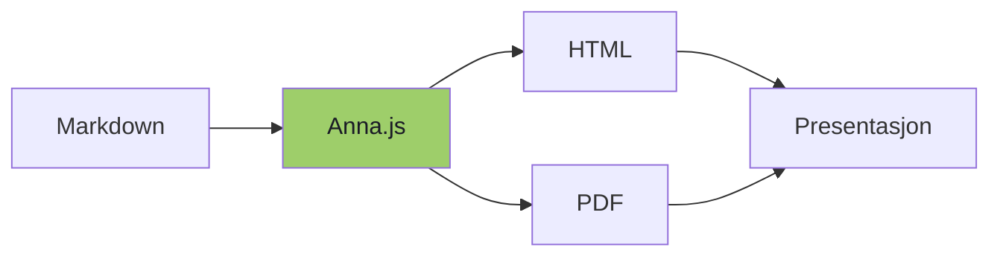
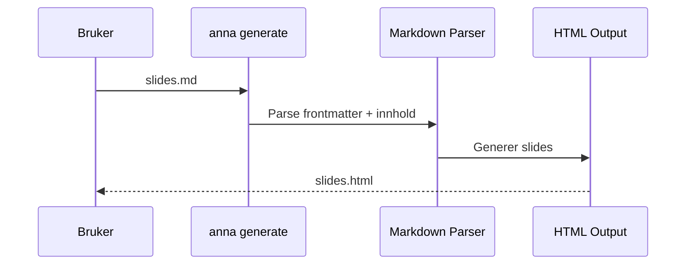

# Anna.js

### Presentasjoner i Markdown

Skrevet av [Knut W. Horne](https://kwhorne.com)

---

## Hvorfor Markdown?

<!-- .fragments -->
- Skriv presentasjoner raskt
- Ingen HTML-kunnskap nødvendig
- Versjonskontroll med Git
- Fokuser på innholdet

---

## Temaer

Velg blant 12 innebygde temaer i frontmatter:

```yaml
---
theme: moon
transition: slide
---
```

Tilgjengelige: black, white, league, beige, sky, night, serif, simple, solarized, blood, moon

---

## Vertikal navigasjon

Trykk ned for mer!

--

### Vertikale slides

Bruk `--` for å lage vertikale slides

```markdown
## Horisontal slide

Innhold

--

### Vertikal slide

Mer innhold
```

--

### Perfekt for detaljer

Organiser innholdet hierarkisk:

- Hovedpunkter horisontalt
- Detaljer vertikalt

---

## Kode

```javascript
// Generer presentasjon fra markdown
const fs = require('fs');

Anna.generate('presentasjon.md');
```

```python
# Eller bruk Python
def hello():
    print("Hello from Anna.js!")
```

---

<!-- .slide: data-background="#4d7e65" -->

## Bakgrunnsfarger

Bruk slide-attributter for egne bakgrunner:

```html
<!-- .slide: data-background="#4d7e65" -->
```

---

## Speaker Notes

Denne sliden har speaker notes!

Trykk **S** for å åpne speaker-vinduet.

Note:
Her er notatene som bare presentatøren ser.

- Husk å nevne markdown-formatet
- Vis frem kode-eksemplene
- Spør om det er spørsmål

---

## Diagrammer



---

## Sekvensdiagram



---

## Live Code

```playground
const languages = ["JavaScript", "HTML", "CSS"];

languages.forEach((lang, i) => {
  console.log(`${i + 1}. ${lang}`);
});

console.log("\nEdit koden og trykk Ctrl+Enter!");
```

---

## HTML Playground

```playground html
<div style="text-align: center; padding: 20px;">
  <h2 style="color: coral;">Hei fra Anna.js!</h2>
  <p>Rediger HTML-en og trykk <b>Run</b>.</p>
  <button onclick="this.textContent='Klikket!'"
          style="padding: 10px 24px; font-size: 16px;
                 background: coral; color: white;
                 border: none; border-radius: 6px;
                 cursor: pointer;">
    Klikk meg
  </button>
</div>
```

---

## Terminal Demo

```terminal
$ npm install -g anna.js
added 42 packages in 2.3s

$ anna init my-presentation
  Copying Anna.js assets...
  ✓ Created slides.md
  ✓ Generated slides.html

$ anna generate slides.md --watch
  ✓ slides.md → slides.html
  Watching slides.md for changes...
```

---

## Kom i gang

```bash
# Lag en presentasjon
npx anna init my-presentation

# Med watch-modus
npx anna generate slides.md -w
```

---

# Takk!

[github.com/kwhorne/anna.js](https://github.com/kwhorne/anna.js)
